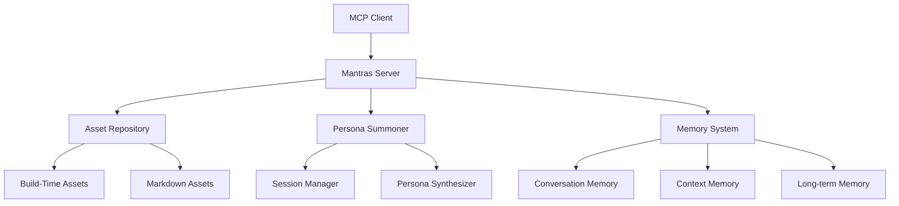

# 🎭 Mantras MCP 服务器

> 企业级 AI 资产管理、Persona 召唤和智能提示工程平台

[](package.json)
[](https://www.typescriptlang.org/)
[](https://modelcontextprotocol.io/)

## ✨ 核心特性

### 🏗️ 构建时资产优化 (NEW!)
- **构建时处理** - 预编译资产，提升 10x 加载性能
- **智能验证** - 构建时发现格式错误和数据问题
- **类型安全** - 自动生成 TypeScript 类型定义
- **统计洞察** - 自动生成资产统计和索引信息

### 📁 统一资产管理 (NEW!)
- **Markdown 优先** - 人类友好的 Markdown + Front Matter 格式
- **智能加载** - 优先使用构建时数据，回退到实时解析
- **自动同步** - 元数据自动同步和完整性验证
- **版本控制友好** - Git diff 清晰，便于团队协作

### 🧠 智能记忆系统
- **对话历史管理** - 自动记录和智能检索对话
- **多类型记忆存储** - 事实、任务、偏好、上下文记忆
- **智能记忆检索** - 相关性算法和语义搜索
- **记忆分析洞察** - 模式识别和连接发现
- **会话间记忆继承** - 全局记忆和知识积累

### 🎭 Persona 召唤系统
- **17个专业资产** - 6个人格 + 10个提示模板 + 1个提示
- **智能召唤** - 基于意图的自动人格选择
- **会话管理** - 多会话并发和状态管理
- **记忆集成** - 每个 persona 都具备记忆能力
- **动态合成** - 组合多个人格创建新的专家

### 📝 提示工程增强
- **10大核心技巧** - 基于《程序员的提示工程实战手册》
- **多种创建方式** - 向导、Web编辑器、模板组合
- **智能推荐** - 基于上下文的模板推荐
- **参数化模板** - 动态参数替换和验证

## 🚀 快速开始

### 安装和构建
```bash
# 克隆项目
git clone <repository-url>
cd mantras

# 安装依赖
npm install

# 构建项目 (包含资产处理)
npm run build

# 启动服务器
npm start
```

### 开发模式
```bash
# 开发模式 (实时加载 Markdown 资产)
npm run dev

# 仅构建代码 (跳过资产处理)
npm run build:dev
```

### 验证安装
```bash
# 查看资产状态
npm run assets:stats

# 测试记忆系统
npm run memory:demo

# 测试人格系统  
npm run persona:demo
```

## 🛠️ 资产管理

### 构建时处理
```bash
npm run build:assets     # 处理和验证资产
npm run build:code       # 编译 TypeScript 代码
npm run build           # 完整构建流程
```

### 资产维护
```bash
npm run assets:migrate   # 迁移 JSON 到 Markdown
npm run assets:sync      # 同步元数据
npm run assets:cleanup   # 清理重复文件
npm run assets:validate  # 验证资产完整性
```

### 开发工具
```bash
npm run assets:demo      # 功能演示
npm run prompt:create    # 创建提示模板
npm run prompt:manage    # 管理提示模板
```

## 📊 性能优化

| 模式 | 首次加载 | 缓存加载 | 内存使用 | 适用场景 |
|------|----------|----------|----------|----------|
| 构建时优化 | ~5ms | <1ms | 低 | 生产环境 |
| Markdown 解析 | ~50ms | ~1ms | 中等 | 开发环境 |

### 生产部署
```bash
# 使用构建时优化的资产
npm run build
npm start -- --use-build-assets

# 指定自定义资产目录
npm start -- --assets-dir /path/to/assets
```

## 🎭 MCP 工具集

### 核心工具
- **`init`** - 系统初始化和概览
- **`list_assets`** - 列出所有可用资产
- **`get_asset`** - 获取特定资产详情
- **`summon_persona`** - 召唤指定人格
- **`summon_by_intent`** - 基于意图智能召唤

### 记忆管理
- **`manage_memory`** - 管理对话、上下文和长期记忆
- **`analyze_memory`** - 分析记忆模式和洞察
- **`get_session`** - 获取会话详情
- **`release_session`** - 结束活跃会话

### 高级功能
- **`synthesize_persona`** - 合成新人格
- **`apply_mantra`** - 应用提示模板
- **`create_execution_plan`** - 创建执行计划
- **`get_project_context`** - 获取项目上下文

## 📁 资产结构

### Persona 资产 (6个)
```
assets/personas/
├── analyst.md          # 数据分析师
├── creative.md         # 创意作家  
├── helper-persona.md   # 通用助手
├── mcp-summoner.md     # 人格召唤师
├── tech-expert.md      # 技术专家
└── therapist.md        # 支持专家
```

### 提示模板 (10个)
```
assets/prompt-templates/
├── role-prompting.md           # 角色提示
├── explicit-context.md         # 明确上下文
├── input-output-examples.md    # 输入输出示例
├── iterative-chaining.md       # 迭代式链条
├── debug-simulation.md         # 模拟调试
├── feature-blueprinting.md     # 功能蓝图
├── refactor-guidance.md        # 重构指导
├── ask-alternatives.md         # 寻求替代方案
├── rubber-ducking.md           # 小黄鸭调试法
└── constraint-anchoring.md     # 约束锚定
```

## 🏗️ 架构概览



## 🔧 开发指南

### 添加新 Persona
1. 在 `assets/personas/` 创建 Markdown 文件
2. 使用标准 Front Matter 格式
3. 运行 `npm run assets:sync` 同步
4. 运行 `npm run build:assets` 验证

### 创建提示模板
1. 使用 `npm run prompt:create` 向导
2. 或直接在 `assets/prompt-templates/` 创建
3. 包含完整的参数说明和示例
4. 运行构建验证格式

### 扩展功能
1. 在 `src/tools/` 添加新工具
2. 在 `src/server.ts` 注册工具
3. 添加相应的测试文件
4. 更新文档和示例

## 📚 文档

### 用户指南
- [快速开始](docs/getting-started.md)
- [核心概念](docs/core-concepts.md)
- [统一资产管理](docs/guides/unified-asset-management.md)
- [构建时资产处理](docs/guides/build-time-asset-processing.md)

### 开发者指南
- [架构说明](docs/architecture/README.md)
- [API 参考](docs/reference/commands.md)
- [内存系统](docs/guides/memory-system.md)
- [Persona 系统](docs/guides/persona-system.md)

### 维护文档
- [脚本清理总结](docs/maintenance/script-cleanup-summary.md)
- [资产读取分析](docs/maintenance/asset-reading-analysis.md)
- [文档更新计划](docs/maintenance/documentation-update-plan.md)

## 🤝 贡献

1. Fork 项目
2. 创建功能分支 (`git checkout -b feature/amazing-feature`)
3. 提交更改 (`git commit -m 'Add amazing feature'`)
4. 推送到分支 (`git push origin feature/amazing-feature`)
5. 开启 Pull Request

### 开发环境设置
```bash
# 克隆项目
git clone <your-fork>
cd mantras

# 安装依赖
npm install

# 开发模式
npm run dev

# 运行测试
npm test

# 构建验证
npm run build
```

## 📄 许可证

本项目采用 ISC 许可证 - 查看 [LICENSE](LICENSE) 文件了解详情。

## 🙏 致谢

- [Model Context Protocol](https://modelcontextprotocol.io/) - 强大的 AI 集成协议
- [《程序员的提示工程实战手册》](ref/prompt-engineering-playbook-zh.md) - 提示工程最佳实践
- 所有贡献者和用户的反馈和支持

---

**🚀 立即开始**: `npm install && npm run build && npm start`